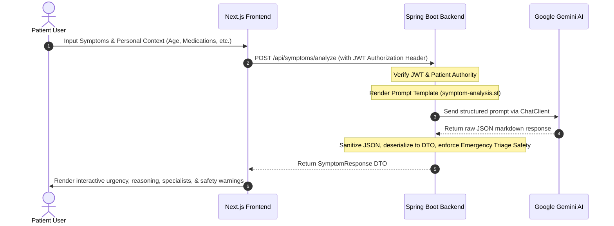

# 🩺 Medora AI

> **AI-First Healthcare Navigation Platform** — Empowering patients to understand their symptoms, receive clinical urgency recommendations, find appropriate specialists, and prepare for medical consultations safely.

---

## 🏛️ System Architecture

### High-Level Component Map


### AI Symptom Assessment Sequence


---

## 💻 Tech Stack

| Layer | Technologies & Libraries |
| :--- | :--- |
| **Frontend** | Next.js 15 (App Router), React, Tailwind CSS, Shadcn UI, Framer Motion, Axios, Zustand |
| **Backend** | Spring Boot 3.3.5, Spring Security 6 (Stateless JWT), Spring AI 1.1.8 (Google GenAI integration) |
| **Database** | PostgreSQL 16 (with `pgvector` for future RAG), Hibernate JPA |
| **Model** | Gemini 2.0 Flash |

---

## 📂 Project Structure

```
d:\Medora AI\
├── frontend/          # Next.js 15 App Router
├── backend/           # Spring Boot 3.x + Spring AI
│   ├── src/
│   │   ├── main/
│   │   │   ├── java/com/medora/
│   │   │   │   ├── auth/       # Authentication, filters, JWT services
│   │   │   │   ├── common/     # Global exceptions and API responders
│   │   │   │   ├── config/     # Security, CORS, and Spring AI beans
│   │   │   │   ├── patient/    # Patient profile entities and JPA repositories
│   │   │   │   └── symptom/    # AI Symptom Checker endpoints and Prompt services
│   │   │   └── resources/
│   │   │       ├── prompts/    # LLM Triage instructions
│   │   │       └── application.yml
│   └── pom.xml
├── docker-compose.yml # Containerized database infrastructure
├── .env               # Local configuration variables
└── README.md
```

---

## 🚀 Setup & Launch Guide

### 1. Database Setup (Choose Option A or B)

#### Option A: Local PostgreSQL (Without Docker)
1. Ensure your local PostgreSQL service is running on port `5432`.
2. Connect to it using your favorite database editor (pgAdmin, DBeaver, etc.) and create a database named `Medora`:
   ```sql
   CREATE DATABASE "Medora";
   ```
   *Note: Default database fallback values in `application.yml` are set to connect with username `postgres` and password `root`.*

#### Option B: Containerized PostgreSQL & Redis (With Docker)
1. Start the containerized services from the root folder:
   ```bash
   docker compose up -d
   ```

---

### 2. Backend Launch
From the `backend/` directory:
1. Ensure you have the `SPRING_AI_GOOGLE_API_KEY` defined (e.g. from the root `.env` file).
2. Run the application:
   ```powershell
   .\mvnw clean spring-boot:run
   ```
3. Verify the server is running by hitting the health check endpoint:
   👉 [http://localhost:8080/actuator/health](http://localhost:8080/actuator/health) (Should return `{"status":"UP"}`)
4. Access interactive API documentation:
   👉 **[http://localhost:8080/swagger-ui.html](http://localhost:8080/swagger-ui.html)**

---

### 3. Frontend Launch
From the `frontend/` directory:
1. Install dependencies:
   ```bash
   npm install
   ```
2. Start the Next.js development server:
   ```bash
   npm run dev
   ```
3. Open your browser to [http://localhost:3000](http://localhost:3000).

---

## 🛠️ Key Bugfixes & Audit Log

During our recent project audit, we completed several critical adjustments:

* **Spring Security 6 CORS Preflight Fix:** Converted the `CorsFilter` bean to a `CorsConfigurationSource` and explicitly integrated it into the Spring Security Filter Chain using `.cors(Customizer.withDefaults())` to prevent preflight blocks (`OPTIONS` errors) in the frontend.
* **Spring AI ChatClient Integration:** Resolved the missing `ChatClient` bean definition error by introducing [AiConfig.java](file:///d:/Medora%20AI/backend/src/main/java/com/medora/config/AiConfig.java) which instantiates `ChatClient` using the auto-configured builder.
* **Windows Maven Wrapper escape bug:** Patched `mvnw.cmd` to automatically strip trailing backslashes from path variables, resolving command goal truncation errors.
* **Target JVM Compatibility:** Configured the maven compiler options to compile targeting **Java 17** to match the active host runtime environment, preventing `UnsupportedClassVersionError` crashes.
* **Landing Page Clean Up:** Streamlined navigation links to match functional routes (Home, Features, Triage Guide, Safety Protocol), implemented automatic active section highlighting on scroll, and removed the video intro sequence.
