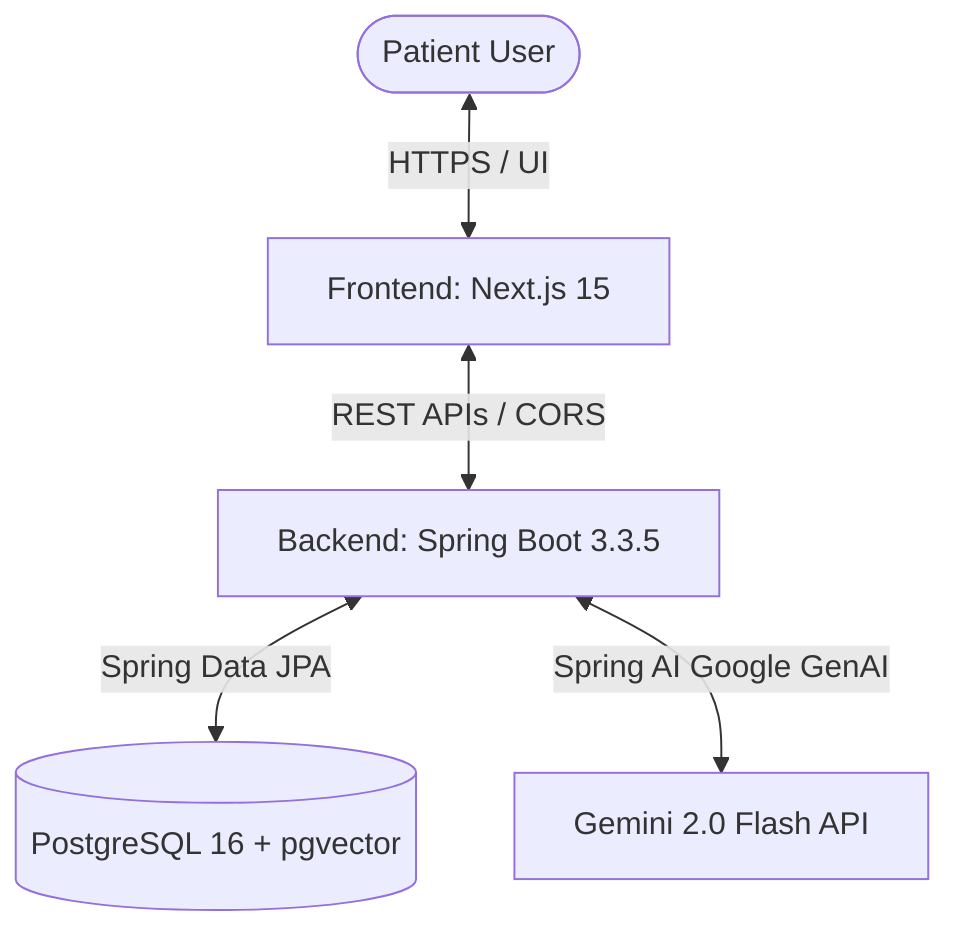
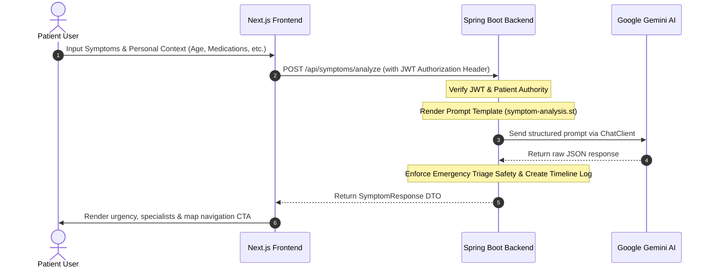

# 🩺 Medora AI

> **AI-First Healthcare Navigation Platform** — Empowering patients to understand their symptoms, receive clinical urgency recommendations, find appropriate specialists, upload/summarize medical reports, and track their health over time.

---

## 🏛️ System Architecture

### High-Level Component Map


### AI Symptom Assessment Sequence


---

## 💻 Tech Stack

| Layer | Technologies & Libraries |
| :--- | :--- |
| **Frontend** | Next.js 15 (App Router), React, Tailwind CSS, Shadcn UI, Framer Motion, Axios, Zustand, Google Maps Javascript API |
| **Backend** | Spring Boot 3.3.5, Spring Security 6 (Stateless JWT), Spring AI 1.1.8 (Google GenAI integration), Hibernate JPA |
| **Database** | PostgreSQL 16 (with `pgvector` for future RAG), Hibernate JPA |
| **Model** | Gemini 2.0 Flash (Multimodal context parsing) |

---

## 📂 Project Structure

```
d:\Medora AI\
├── frontend/          # Next.js 15 App Router
│   ├── src/
│   │   ├── app/
│   │   │   ├── care-map/    # Hospital list and Google Maps navigation route
│   │   │   ├── reports/     # Medical Report summarization & upload dropzones
│   │   │   ├── timeline/    # Patient health chronological feed
│   │   │   └── dashboard/   # Dashboard links & analytics tracking
│   │   └── components/
├── backend/           # Spring Boot 3.x + Spring AI
│   ├── src/
│   │   ├── main/
│   │   │   ├── java/com/medora/
│   │   │   │   ├── auth/       # Authentication, filters, JWT services
│   │   │   │   ├── common/     # Global exceptions and API responders
│   │   │   │   ├── config/     # Security, CORS, and Spring AI beans
│   │   │   │   ├── patient/    # Patient profile entities and JPA repositories
│   │   │   │   ├── report/     # Medical reports entities, Gemini OCR, and controllers
│   │   │   │   ├── timeline/   # Chronological log events services & controllers
│   │   │   │   └── symptom/    # AI Symptom Checker endpoints and Prompt services
│   │   │   └── resources/
│   │   │       ├── prompts/    # LLM Triage instructions
│   │   │       └── application.yml
│   └── pom.xml
├── docker-compose.yml # Containerized database infrastructure
├── .env               # Local configuration variables
└── README.md
```

---

## 🚀 Setup & Launch Guide

### 1. Database Setup
Ensure PostgreSQL is running locally on port `5432` with a database named `Medora`. If using Docker:
```bash
docker compose up -d
```

### 2. Configuration Setup
Create an `.env` file in the root directory and add the following keys:
```env
# Google Gemini API key
SPRING_AI_GOOGLE_API_KEY=your_gemini_key

# Google Maps API key
NEXT_PUBLIC_GOOGLE_MAPS_KEY=your_google_maps_key
```

### 3. Backend Launch
From the `backend/` directory, run the Maven wrapper:
```powershell
# Windows PowerShell
.\mvnw clean spring-boot:run
```
* Health Endpoint: [http://localhost:8080/actuator/health](http://localhost:8080/actuator/health)
* Swagger Documentation: [http://localhost:8080/swagger-ui.html](http://localhost:8080/swagger-ui.html)

### 4. Frontend Launch
From the `frontend/` directory, install dependencies and start the Next.js development server:
```bash
npm install
npm run dev
```
Open [http://localhost:3000](http://localhost:3000) in your browser.

---

## 🛠️ Key Bugfixes & Audit Log

* **Spring Security 6 CORS Preflight Fix:** Converted the `CorsFilter` bean to a `CorsConfigurationSource` to prevent preflight blocks (`OPTIONS` errors) in the frontend.
* **Spring AI ChatClient Integration:** Introduced `AiConfig.java` which instantiates `ChatClient` using the auto-configured builder.
* **Smart Care Map Module:** Integrated Google Maps, directions polylines, segmented filter chips, interactive detail drawers, and emergency call overlays. Includes automatic zoom mapping (`fitBounds`) and viewport memory leak cleanups.
* **Multimodal Report Summarization (Phase 2):** Created file upload zones utilizing Google Gemini 2.0 to perform OCR on medical reports, highlighting High/Low laboratory results.
* **Chronological Health Timeline (Phase 2):** Integrated vertical timeline tracks tracking auto-generated symptom assessments, reports uploads, and manually logged milestones.
* **Profile Layout Audit:** Redesigned the Patient Health Profile page into a balanced side-by-side grid, separating Personal Demographics and Clinical Context on desktop viewports.

